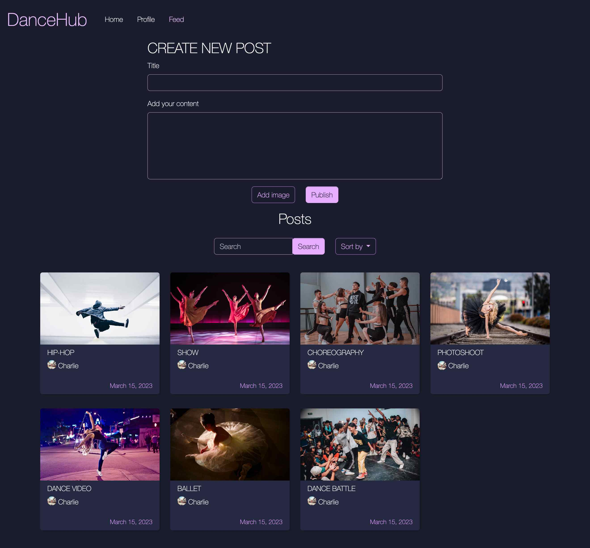

# Charlotte Valset - CSS-frameworks-ca



I am a front-end developer student at Noroff and a UX designer, please check out my CSS Framework assignment, a social-app site for dancers - [DanceHub](https://dancehub.netlify.app)

## Description

I made the design and wireframes in Figma, followed by building a fully responsive website using Bootstrap and styling it with SASS and making it functionable with vanilla JS.

I had to use custom classes on a couple of places where I couldn't figure out how to style it with Bootstrap and SASS. If you find a way to fix it using Bootstrap and SASS, let me know!

Check out my Trello board for the JS2 assigment [Social-app JS2_CA](https://trello.com/b/oGbiICo7/social-app-js2ca)

## Built With

- Bootstrap
- SASS
- Vanilla JS

## Getting Started

### Installing

1. Clone the repo:

```bash
git clone https://github.com/CharlotteValset/css-frameworks-ca.git
```

2. Install the dependencies:

```
npm install
```

### Running

To run the app, run the following commands:

```
npm run watch
```

## Contributing

If you'd like to get involved in the project, please consider one of the following options:

- Submit a Pull Request:
  If you've made modifications or enhancements to the codebase, it is encouraged that you initiate a pull request (PR).

- Report an Issue:
  Should you encounter an issue or have a feature request, don't hesitate to create an issue. Please describe the problem or the enhancement you have in mind in as much detail as possible. This will assist me in tracking and prioritizing community input.

## Contact

Please contact me through:

[My Portfolio page](https://charlottevalset-portfolio.netlify.app)

[My LinkedIn page](https://www.linkedin.com/in/charlotte-valset-6195b521a/)

## Acknowledgments

I would like to ackowledge my mentor, Eric Pretzinger - for guiding me and making me a better Front-End Developer, and also my fellow FED students at Noroff for helping me when I got stuck!
