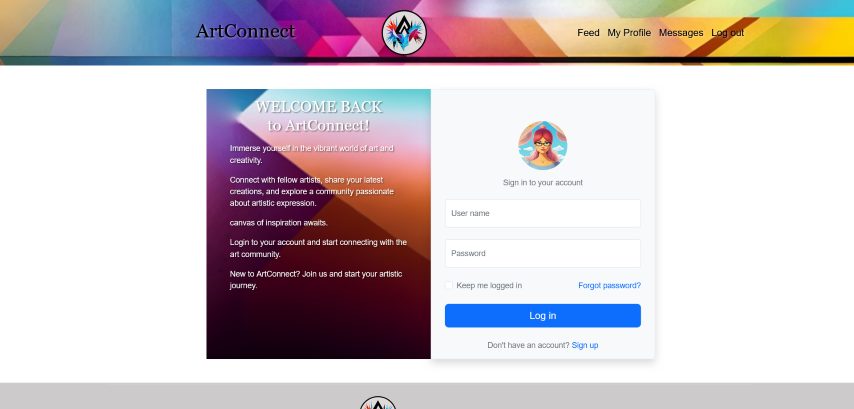

# css-frameworks-ca
Replace this text with a description of your social media project.


A socialmedia app for people to share their art

## Description

A project to learn bootstrap and SASS

created a social media app where people can share pictures of art and get feedback

- Profile page with profile image, username, user posts, area to display followers and follow button
- Login page with authentication, HTML form validation
- Feed page with list of posts, search bar, sort options


## Built With

- HTML
- CSS
- JS
- Bootstrap
- SCSS
- SASS

## Getting Started

### Installing

clone the repo and install.

1. Clone the repo:

```bash
git clone https://github.com/IceGreenGalactic/css-frameworks-ca.git

2. Install the dependencies:

```bash
npm install-D sass
```
```bash
npm install bootstrap@5.3.2
```
```bash
npm install-D live-server
```
### Running

To run the app, run the following commands:

```bash
npm run dev
```

## Contact

[My LinkedIn page](https://www.linkedin.com/in/kristine-tyrholm-7902172a4)

