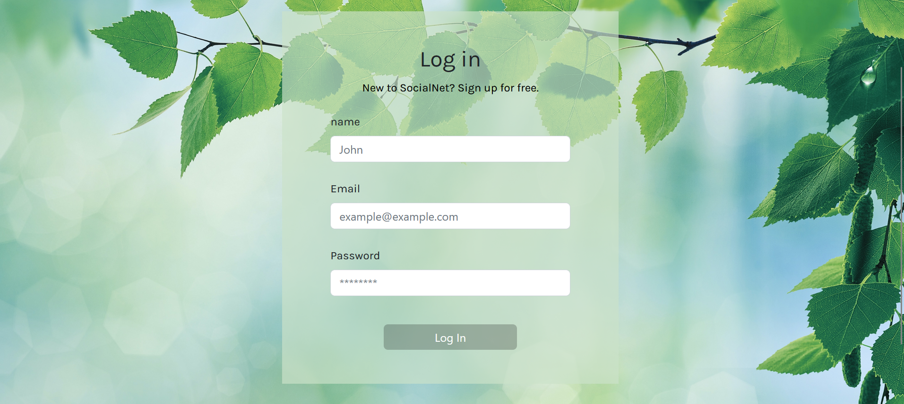

# css-frameworks-ca

Trello board:
https://trello.com/b/SJw4kak0/js2

;

This is a mock-up social application called SocialNet for the JS2 ca
Built with:

    Html
    SCSS
    Bootstrap
    java script
    JSDocs
    Noroff API (School's API for this assignment)

Getting started:

    Clone the repo::

Git clone https://github.com/LineNil/css-frameworks-ca/tree/js2

    install dependencies
    npm run watch

    or open live site: 

    https://js2courseassignment.netlify.app/

