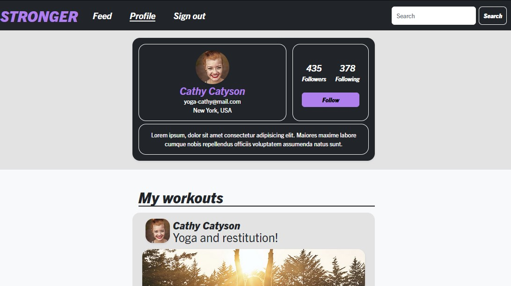

# css-frameworks-ca

# Social media site - Stronger together



In this project the task was to create a social media site using Bootstrap and SASS with essential pages like:

-   Sign in page
-   Feed page
-   Profile page

## Description

The project involved Adobe XD for design and HTML, CSS, Bootstrap and SASS for website development.

Elements that had to be implemented in the project:

-   Sign in page: Form validation
-   Feed page: List of posts thumbnails, a search bar, sort options and a form to create a new post
-   Profile page: a profile image, username, list of user posts, follow button and an area to display following/followers

There were no requirments for JS functionality beyond Bootstrap UX behaviour. For example, using the provided dropdowns were acceptable without further custom JS.

As I continue to learn JavaScript I will improve the site accordingly.

### Programs used to deliver end product:

-   Adobe XD
-   Visual studio Code
-   BootstrAap
-   SASS
-   GitHub

## Built With

-   HTML
-   CSS
-   JavaScript (not custom JS)
-   SASS
-   Bootstrap

## Getting Started

### Installing

1. Clone the repo:

```bash
git clone git@github.com:EliseAur/css-frameworks-ca.git
```

2. Install dependencies:

```
npm install bootstrap@5.2.0

npm install -D sass

npm install -D live-server

```

### Running

To run the app, run the following commands:

```bash
npm run dev
```

or

```bash
npm run watch
```

## Contributing

If you want to contribute to my project you can use the contact information below.
I will be happy for all inquiries regarding the project.

## Contact

Feel free to contact me if you have any questions or feedback about the project.

-   E-mail: elise.aurtande@hotmail.com
-   GitHub: www.github.com/EliseAur
-   Discord: Elise Aug21 PT
